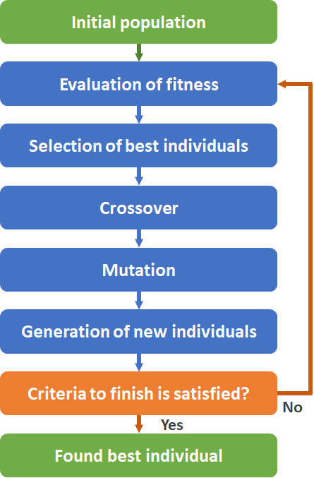
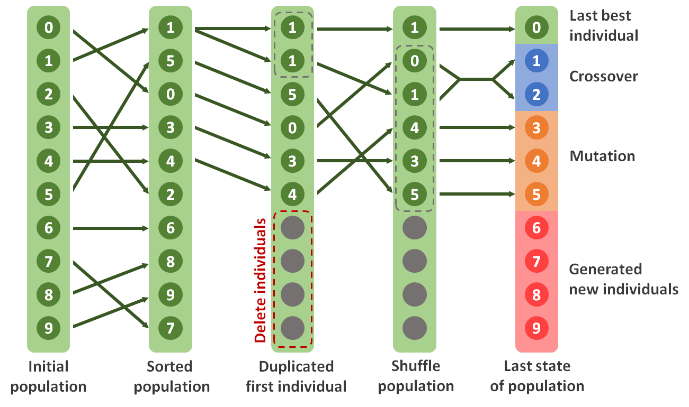
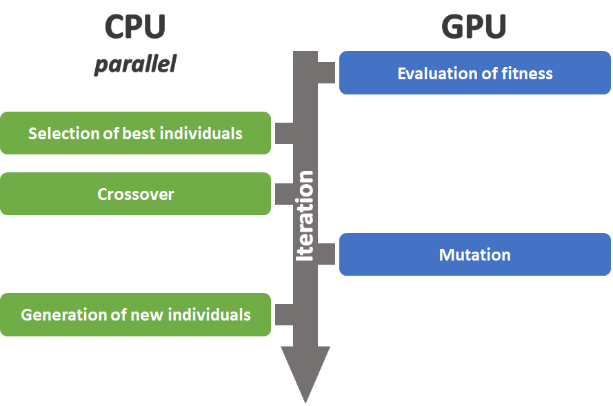

# Genetic Algorithm GPU-CPU

This repo is an implementation of a genetic algorithm using maximum GPU and CPU calculation acceleration. 
The GitHub project is made of two parts: the first one is an implementation of a classic genetic algorithm 
and the second one is an implementation of a genetic algorithm optimized for GPU and CPU calculation.
The implementation of genetic algorithm in this project is intended for the [traveling salesman problem](https://en.wikipedia.org/wiki/Travelling_salesman_problem).

## What is a genetic algorithm?

Genetic algorithms are a type of artificial intelligence algorithms.
Their goal is to obtain solutions to optimization problems by minimizing an evaluation function.
Work on genetic algorithms was theorized in the 1960s by John Holland and his colleagues.

Genetic algorithms use the notion of natural selection applied to a target population.
The goal is to simulate the evolution of a population in order to obtain an individual with high-performance that corresponds to a solution.
Genetic algorithms are iterative and rely on a succession of evolution cycles.


## How genetic algorithm works?

There is a multitude of implementations of genetic algorithms.
The following diagram presents more precisely the operation of the genetic algorithm implemented in this project.



_Operation of a genetic algorithm._

During each iteration, the generic algorithm divides the population into 3 parts:
* crossover : crossing the genes of 2 individuals in order to obtain 2 new ones.
* mutation : random mutation of an individual's genes.
* regeneration : regeneration of new individuals.

The following diagram shows, for a typical population of 10 individuals, the different steps and transformations carried out during an iteration:



_Operation of a genetic algorithm iteration._

The order of the operations is specific to this project and different implementations are possible.

## GPU-CPU optimization

The genetic algorithm has been implemented a second time to make maximum use of the optimizations of the CPU and the cuda cores integrated into the GPU, in order to decrease the calculation time.
The [Numba library](https://numba.pydata.org/numba-doc/latest/index.html) is used for better optimization of the calculation time of the algorithms with the use of the GPU and the CPU.
The following diagram shows what were the main optimizations:




_Distribution of tasks between GPU and CPU._

The scoring and mutation methods are executed on cuda cores, since they are composed of calculations compatible with Nvidia GPUs.
The methods of selecting the best individuals, crossover and generating new individuals work in parallel on a CPU, with the use of all the available cores.

## Tree of the project

Tree of the Genetic_Algorithm_GPU-CPU project:

```
Genetic_Algorithm_GPU-CPU
├───genetic_algorithm.py # Main file of the project
├───README.md
├───requirements.txt
│
├───classic_genetic_algorithm # Classic implementation
│   ├───classic_genetic_algorithm.py # Method of classic implementation
│   │
│   └───genetic
│       ├───crossover.py
│       ├───evaluation.py
│       ├───evolution.py
│       ├───init_population.py
│       ├───mutation.py
│       └───selection.py
│
├───comparison_classic_vs_optimized
│   └───comparison_classic_vs_optimized.py
│
├───dataset
│   ├───dantzig42.txt
│   └───dataset10city.txt
│
├───display
│   ├───display_comparison.py # Generate tracking screen
│   └───score_board.py # Generate the comparison graphs
│
├───optimized_genetic_algorithm # Optimize implementation
│   ├───optimized_genetic_algorithm.py # Method of optimized implementation
│   │
│   ├───genetic
│   │   ├───crossover.py
│   │   ├───evaluation.py
│   │   ├───evolution.py
│   │   ├───init_population.py
│   │   ├───mutation.py
│   │   └───selection.py
│   │
│   └───utils
│       └───utils.py
│
├───processing_dataset
│   └───processing_dataset.py # Tools for processing data
│
├───resources
│   ├───GA_tasks_GPU-CPU.png
│   ├───GA_working.png
│   └───GA_working_of_an_iteration.png
│
└───results
```

## Install

You need to use python 3.9.

To work you need to install CUDA Toolkit with a version compatible with your GPU.

If you need to create a virtual environment to clone the project:

` python3 -m venv Genetic_Algorithm_environment `

` source Genetic_Algorithm_environment/bin/activate `

` cd Genetic_Algorithm_environment `

Clone the repository :

` git clone https://github.com/TimLC/Genetic_Algorithm_GPU-CPU.git`

Install package requirements :

` pip install -r requirements.txt `

## How to run

To run the classical genetic algorithm, use the following command:
```
python genetic_algorithm.py
    --action classic # (Mandatory)
    --dataset_name dantzig42 # (Mandatory) Dataset name
    --size_population 8192 # Number of individuals in the population
    --number_generation 10000 # Number of iterations
    --population_rate_to_keep 0.50 # Percentage of population who is kept to add transformations (crossover or mutation)
    --mutation_rate 0.1 # Percentage of chance that a gene mutates
    --number_step_to_actualize_view 100 # Number of iterations before refreshing the screen
```

To run the optimized genetic algorithm, use the following command:
```
python genetic_algorithm.py
    --action optimize # (Mandatory) classic OR optimize 
    --dataset_name dantzig42 # (Mandatory) Dataset name
    --size_population 8192 # Number of individuals in the population
    --number_generation 10000 # Number of iterations
    --population_rate_to_keep 0.50 # Percentage of population who is kept to add transformations (crossover or mutation)
    --mutation_rate 0.1 # Percentage of chance that a gene mutates
    --number_step_to_actualize_view 100 # Number of iterations before refreshing the screen
    --threads_per_block 1024 # Number of cuda threads per block
```

## Results

The two implementations (classic and optimized) can be compared according to 2 configurations:
* Evolution of the size of the population.

```
python genetic_algorithm.py
    --action comparison_size_population # (Mandatory)
    --dataset_name dantzig42 # (Mandatory) Dataset name
    --size_population [1024, 2048, 4096, 8192] # Number of individuals in the population
    --number_generation 10000 # Number of iterations
    --population_rate_to_keep 0.50 # Percentage of population who is kept to add transformations (crossover or mutation)
    --mutation_rate 0.1 # Percentage of chance that a gene mutates
    --number_step_to_actualize_view 100 # Number of iterations before refreshing the screen
    --threads_per_block 1024 # Number of cuda threads per block
```


* Evolution of the number of generations.

```
python genetic_algorithm.py
    --action comparison_number_generation # (Mandatory)
    --dataset_name dantzig42 # (Mandatory) Dataset name
    --size_population 8192 # Number of individuals in the population
    --number_generation [100, 1000, 10000] # Number of iterations
    --population_rate_to_keep 0.50 # Percentage of population who is kept to add transformations (crossover or mutation)
    --mutation_rate 0.1 # Percentage of chance that a gene mutates
    --number_step_to_actualize_view 100 # Number of iterations before refreshing the screen
    --threads_per_block 1024 # Number of cuda threads per block
```


## Author

Created by **Timothé Le Chatelier** in **2022**

